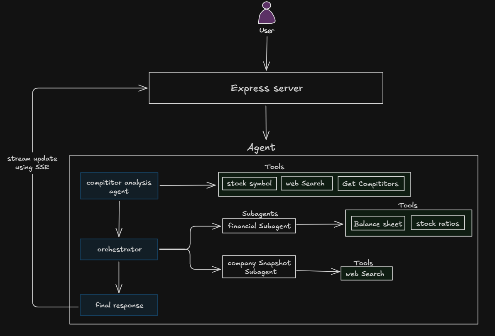

# Competitive Research Agent

A small agentic AI system that builds a competitive landscape brief for a company using live public data. It accepts a company name, discovers competitors, delegates qualitative and financial research, and streams the execution trace to the UI.

## Assignment Coverage

- **Goal input:** company name from the React UI, sent to `POST /competitive-analysis`.
- **Planning trace:** LangGraph node and tool activity is streamed as Server-Sent Events (SSE).
- **Multiple tools:** NSE APIs, Tavily web search, and Yahoo Finance are used.
- **Self-correction/failure handling:** tool and node calls validate inputs, catch failures, return an explicit `Tool failed`/error result, and continue/report the failed activity instead of silently crashing.
- **Structured result:** the final response is generated after research and rendered as a Markdown competitive brief.

## Architecture



## Project Structure

- `client/` - Vite + React interface for starting research and viewing the live trace/report.
- `server/agent/agent.ts` - LangGraph state, edges, streaming, and invocation entry points.
- `server/agent/nodes/` - discovery, orchestration, and final response nodes.
- `server/agent/subagents/` - qualitative company research and financial research agents.
- `server/agent/tools/` - registered tools and integrations with NSE, Tavily, and Yahoo Finance.

## Nodes, Subagents, and Tools

### Graph nodes

1. **`fetch_competitors`** resolves the target company symbol, finds peers, and produces a shortlist of up to three competitors using Gemini, NSE data, and Tavily.
2. **`orchestrator`** plans the research and delegates company snapshots and financial research through subagent tools.
3. **`final_response`** combines the collected messages into the final competitive comparison.

### Subagents

- **Company snapshot researcher:** uses Tavily to summarize business model, sector, market, regions, ownership, and scale signals.
- **Financial researcher:** uses stock metrics and balance-sheet tools to summarize valuation, profitability, liquidity, and financial health for a verified NSE symbol.

### Tools

- `symbol_extractor_tool` - resolves a company name through the NSE search API.
- `fetch_stocks_peers_information` - fetches NSE industry peers and enriches them with Yahoo Finance names/symbols.
- `tavily_competitor_search` - searches the web for competitor information.
- `get_stock_financial_metrics` - reads current market and valuation metrics from Yahoo Finance.
- `get_balance_sheet` - reads annual balance-sheet time series from Yahoo Finance.
- `company_snapshot_subagent` and `financial_research_subagent` - delegate focused research tasks to subagents.

All activity is logged with a source (`node`, `subagent`, or `tool`), phase, name, and label, then streamed to the client.

## Setup

Requirements: [Bun](https://bun.sh/) and API access for Google Gemini and Tavily.

Create `server/.env`:

```env
TAVILY_API_KEY=your_tavily_key
GOOGLE_API_KEY=your_google_generative_ai_key
```

Do not commit `.env` or expose API keys in source control. The keys included in the assignment prompt should be treated as exposed; rotate them before use if they are real credentials.

Install dependencies:

```bash
cd server
bun install
cd ../client
bun install
```

## Run

Start the API server in one terminal:

```bash
cd server
bun index.ts
```

Start the client in another terminal:

```bash
cd client
bun run dev
```

Open the Vite URL shown in the terminal, usually `http://localhost:5173`. The API listens on `http://localhost:3000` and streams `POST /competitive-analysis` responses as SSE.

Example request:

```bash
curl -N -X POST http://localhost:3000/competitive-analysis ^
  -H "Content-Type: application/json" ^
  -d "{\"companyName\":\"Infosys\"}"
```

For PowerShell, use `curl.exe` if the PowerShell alias behaves differently.

## Representative Trace

```text
[node] start: Finding competitors for Infosys
[tool] start: Resolving the ticker for Infosys
[tool] complete: Ticker lookup complete for Infosys
[tool] start: Looking up peers for INFY
[tool] complete: Peer lookup complete for INFY
[node] complete: Competitor shortlist ready
[node] start: Planning research across the company set
[subagent] start: Researching the business profile of Infosys
[subagent] complete: Business profile ready for Infosys
[subagent] start: Gathering financial evidence for Infosys
[tool] start: Reading market metrics for INFY
[tool] complete: Market metrics received for INFY
[node] complete: Research dispatch complete
[node] start: Writing the final comparison
[node] complete: Final comparison ready
```

When a dependency fails, the corresponding activity is marked as failed and the returned result contains the error, for example: `Tool failed: No peers returned by NSE`. This makes the failure visible in the trace and final report rather than hiding it.

## Limitations and Next Steps

This prototype depends on live third-party APIs, has no persistent cache, and uses model-generated summaries that should be reviewed before making investment decisions. With more time, I would add fixture-backed integration tests, retries with backoff for transient provider failures, source citations in the final report, and a persisted run/evaluation history.
